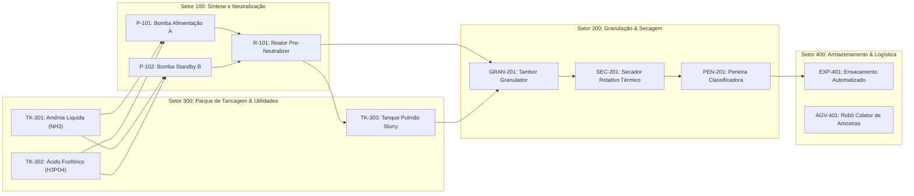

# Planta Modelo: Complexo Industrial de Fertilizantes Químicos NPK

## 1. Contextualização da Engenharia de Processo
A indústria de fertilizantes minerais é um dos pilares mais críticos da indústria química de transformação. Seus processos combinam reações exotérmicas de alta pressão, manuseio de substâncias tóxicas e voláteis ($\text{NH}_3$), ácidos altamente corrosivos ($\text{H}_2\text{SO}_4$, $\text{H}_3\text{PO}_4$, $\text{HNO}_3$) e manuseio de sólidos granulados ($\text{KCl}$, $\text{MAP}$, $\text{DAP}$).

Para garantir a operação contínua e segura deste complexo, o sistema **SCADA-Core Automática** atua na supervisão de 4 grandes setores de produção.

---

## 2. Insumos e Matérias-Primas Primárias (Nutrientes N-P-K)

### 2.1. Fontes de Nitrogênio (N)
* **Gás Natural ($\text{CH}_4$):** Fonte de hidrogênio obtida por reforma a vapor para a síntese catalítica de Haber-Bosch.
* **Amônia Anidra Líquida ($\text{NH}_3$):** Gás liquefeito sob pressão ($15\text{ bar}$) ou refrigerado a $-33^\circ\text{C}$. Reagente básico para uréia, nitrato de amônio e sais fosfatados.
* **Ácido Nítrico ($\text{HNO}_3$):** Ácido forte obtido pela oxidação catalítica da amônia; base para a síntese de Nitrato de Amônio ($\text{NH}_4\text{NO}_3$).

### 2.2. Fontes de Fósforo (P)
* **Rocha Fosfática (Fluorapatita - $\text{Ca}_{10}(\text{PO}_4)_6\text{F}_2$):** Matéria-prima mineral bruta extraída e moída.
* **Ácido Sulfúrico Concentrado ($\text{H}_2\text{SO}_4$ - $98\%$):** Reagente de ataque para a digestão ácida da rocha fosfática na unidade de ácido fosfórico.
* **Ácido Fosfórico Industrial ($\text{H}_3\text{PO}_4$ - $54\% \text{ P}_2\text{O}_5$):** Intermediário de reação para neutralização com amônia na produção de:
  - **MAP (Fosfato Monoamônico):** $\text{NH}_3 + \text{H}_3\text{PO}_4 \rightarrow \text{NH}_4\text{H}_2\text{PO}_4$
  - **DAP (Fosfato Diamônico):** $2\text{NH}_3 + \text{H}_3\text{PO}_4 \rightarrow (\text{NH}_4)_2\text{HPO}_4$
  - **TSP (Superfosfato Triplo):** $\text{Ca}(\text{H}_2\text{PO}_4)_2 \cdot \text{H}_2\text{O}$

### 2.3. Fontes de Potássio (K)
* **Cloreto de Potássio ($\text{KCl}$ - Silvita $60\% \text{ K}_2\text{O}$):** Insumo mineral sólido adicionado na granulação para ajuste do balanceamento N-P-K (ex: fórmulas 04-14-08, 20-00-20, 10-10-10).

---

## 3. Setorização Operacional do Complexo

