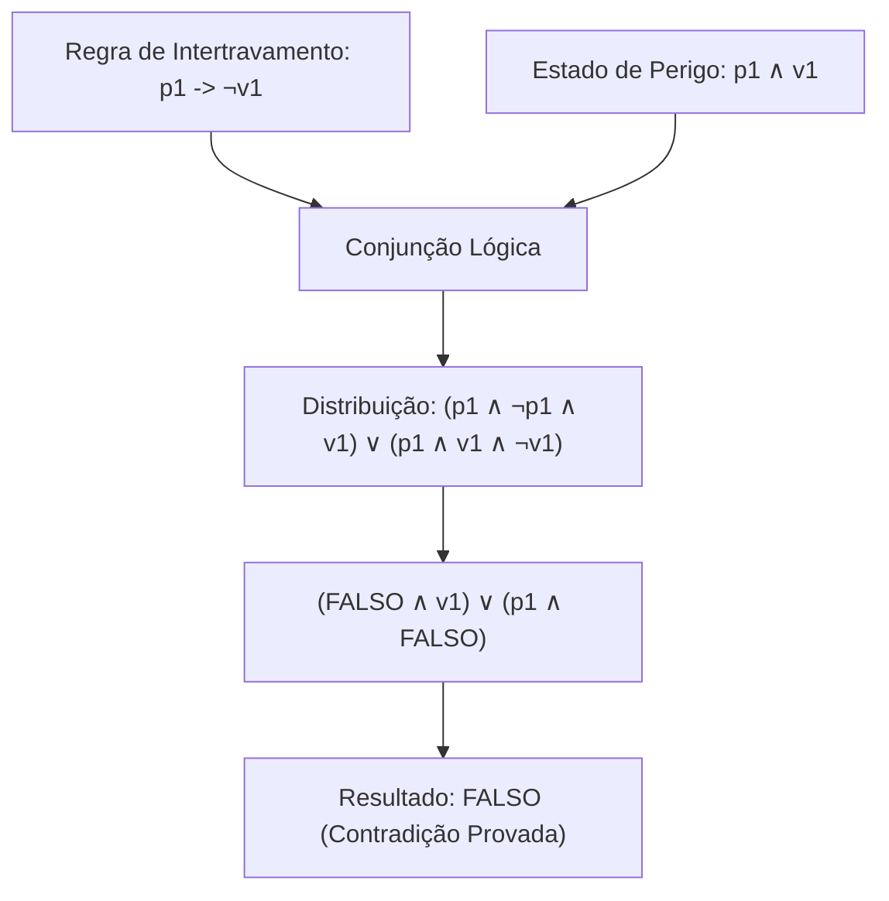

# Aula 03: Tautologias, Contradições e Validação Formal de Intertravamentos

## 1. Fundamentos Matemáticos: Classificação Semântica de Fórmulas Proposicionais

Dada uma fórmula proposicional $W(p_1, p_2, \dots, p_n)$ com $n$ variáveis atômicas, seu espaço de interpretações possui cardinalidade $2^n$.

1. **Tautologia ($\models W$):** Uma fórmula que avalia como **Verdadeira** ($1$) para **todas** as $2^n$ valorações possíveis. Em automação e segurança funcional, uma tautologia representa uma **garantia invariante de segurança** que independe do estado operacional.
2. **Contradição / Insatisfatível ($W \models \bot$):** Uma fórmula que avalia como **Falsa** ($0$) para todas as $2^n$ valorações. Representa a **impossibilidade física e lógica** de ocorrência de um estado perigoso.
3. **Fórmula Contingente / Satisfatível:** Uma fórmula que assume valor Verdadeiro para ao menos uma valoração e Falso para ao menos uma outra. Descreve o comportamento dinâmico operacional padrão da planta.

---

## 2. Modelagem Matemática de Intertravamentos e Prova de Invariante de Segurança

### 2.1. Intertrava de Trip de Emergência do Reator ($\text{R-101}$)
Se houver sobrepressão ($p_1$), sobretemperatura ($t_1$), vazamento tóxico de amônia ($g_1$) ou acionamento do botão de emergência ($e_1$), as válvulas de reagentes devem ser fechadas ($\neg v_1 \land \neg v_2$) e a sirene acionada ($a_1$):

$$F \equiv p_1 \lor t_1 \lor g_1 \lor e_1$$
$$\text{Regra}_{\text{Trip}} \equiv F \rightarrow (\neg v_1 \land \neg v_2 \land a_1)$$

### 2.2. Prova Formal de Teorema de Segurança Funcional (Ausência de Explosão)
* **Estado de Perigo Catastrófico ($S_{\text{perigo}}$):** Operação simultânea com sobrepressão e válvula de amônia aberta:
$$S_{\text{perigo}} \equiv p_1 \land v_1$$

* **Teorema de Segurança:** Sob a vigência estrita da regra de intertravamento no CLP ($p_1 \rightarrow \neg v_1$), o estado de perigo $S_{\text{perigo}}$ é uma **CONTRADIÇÃO**:

$$\Phi = S_{\text{perigo}} \land (p_1 \rightarrow \neg v_1)$$

**Demonstração por Equivalências Notáveis:**
1. Reescrevendo a implicação pela equivalência material ($A \rightarrow B \equiv \neg A \lor B$):
   $$\Phi = (p_1 \land v_1) \land (\neg p_1 \lor \neg v_1)$$
2. Aplicando a propriedade distributiva da conjunção sobre a disjunção:
   $$\Phi = \big((p_1 \land v_1) \land \neg p_1\big) \lor \big((p_1 \land v_1) \land \neg v_1\big)$$
3. Reordenando pelos axiomas de comutatividade e associatividade:
   $$\Phi = \big((p_1 \land \neg p_1) \land v_1\big) \lor \big(p_1 \land (v_1 \land \neg v_1)\big)$$
4. Pelo Princípio da Não-Contradição ($x \land \neg x \equiv \mathbf{F}$):
   $$\Phi = (\mathbf{F} \land v_1) \lor (p_1 \land \mathbf{F})$$
5. Pelo elemento nulo da conjunção ($\mathbf{F} \land x \equiv \mathbf{F}$):
   $$\Phi = \mathbf{F} \lor \mathbf{F} \equiv \mathbf{F} \quad (\text{Q.E.D.})$$

Portanto, a negação do estado de perigo $\neg \Phi \equiv \neg \mathbf{F} \equiv \mathbf{V}$ é uma **TAUTOLOGIA**.

---

## 3. Entregável da Aula 03

* **Verificador Automático de Tautologias e Tabela-Verdade Exaustiva:** Código em Python capaz de classificar formalmente expressões booleanas arbitrárias em Tautologia, Contradição ou Contingência com relatório analítico de segurança funcional.
