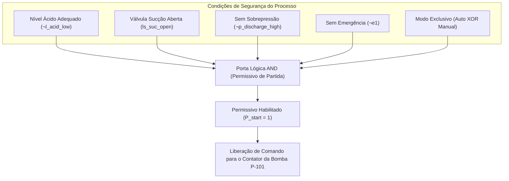

# Aula 04: Lógica Proposicional — Conectivos e Blocos de Permissivos

## 1. Fundamentos Matemáticos: Álgebra Proposicional e Operadores

Na álgebra booleana de Boole-Shannon aplicada à automação de controle, definimos o corpo $\langle \mathbb{B}, \land, \lor, \neg, 0, 1 \rangle$ onde $\mathbb{B} = \{0, 1\}$.

Os operadores fundamentais e suas propriedades na engenharia são:
1. **Negação ($\neg A$ / $\bar{A}$):** Inversão lógica (contatos NF / *Normally Closed*).
2. **Conjunção ($A \land B$):** Associação em **série** (todos os requisitos devem ser satisfeitos simultaneamente).
3. **Disjunção ($A \lor B$):** Associação em **paralelo** (múltiplas condições redundantes de disparo ou falha).
4. **Disjunção Exclusiva ($A \oplus B$):** $(A \land \neg B) \lor (\neg A \land B)$. Seletor de exclusividade operacional mútuo (Modo Local $\oplus$ Modo Remoto).
5. **Implicação Lógica ($A \rightarrow B \equiv \neg A \lor B$):** Condicional de controle "SE causa $A$, ENTÃO efeito $B$".
6. **Bicondicional ($A \leftrightarrow B$):** Equivalência estrita de estados.

---

## 2. Engenharia de Permissivos de Partida (*Start Permissives*) e Intertravamentos Contínuos (*Run Interlocks*)

Conforme a norma **IEC 61131-3** e a prática de projetos petroquímicos e de fertilizantes, a partida de atuadores de grande porte (bombas de pistão, reatores pressurizados, compressores de amônia) exige a separação clara entre:
* **Permissivo de Partida ($P_{\text{start}}$):** Verificado no instante de emissão do pulso de comando de ligar.
* **Intertravamento Contínuo ($I_{\text{run}}$):** Monitorado continuamente a cada ciclo de scan ($10\text{ ms} \dots 100\text{ ms}$). Qualquer violação causa o desligamento imediato (*Trip*).

### 2.1. Permissivo da Bomba de Alimentação $\text{P-101}$ ($\text{H}_3\text{PO}_4$)
$$P_{\text{start}} \equiv \neg l_{\text{acid\_low}} \land ls_{\text{suc\_open}} \land \neg p_{\text{discharge\_high}} \land \neg e_1 \land (\text{Auto} \oplus \text{Manual})$$

### 2.2. Equação de Trip por De Morgan
$$\text{Trip}_{\text{P-101}} \equiv \neg P_{\text{start}} \equiv l_{\text{acid\_low}} \lor \neg ls_{\text{suc\_open}} \lor p_{\text{discharge\_high}} \lor e_1 \lor \neg(\text{Auto} \oplus \text{Manual})$$

---

## 3. Entregável da Aula 04

* **Módulo de Permissivos e Intertravamentos:** Implementação em Python dos blocos de lógica combinacional para $\text{P-101}$, $\text{R-101}$ e granulador $\text{M-201}$, incluindo simulação de transições de modo de operação.
