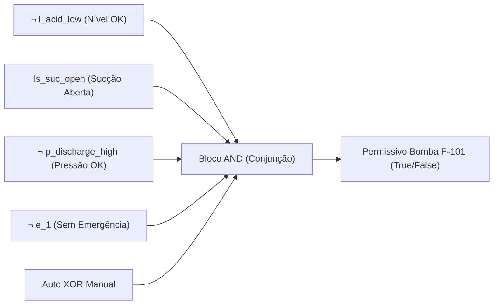

# Aula 04: Lógica Proposicional — Conectivos e Blocos de Permissivos

## 1. Fundamentos Matemáticos: Conectivos Lógicos

Na matemática discreta, uma **proposição** é uma sentença declarativa que assume um e apenas um valor-verdade: **Verdadeiro** ($1$) ou **Falso** ($0$).

As operações sobre variáveis proposicionais são definidas por operadores lógicos fundamentais:
1. **Negação ($\neg A$ ou $\bar{A}$):** Inverte o valor-verdade da proposição.
2. **Conjunção ($A \land B$):** Verdadeira se e somente se ambos os operandos forem verdadeiros. Em automação, modela condições em **série** (intertravamento e permissivos conjuntos).
3. **Disjunção ($A \lor B$):** Verdadeira se ao menos um dos operandos for verdadeiro. Em automação, modela redundâncias ou condições em **paralelo** (múltiplas causas de falha).
4. **Disjunção Exclusiva ($A \oplus B$):** Verdadeira se exatamente um dos operandos for verdadeiro ($\neg(A \leftrightarrow B)$). Usada em seletores de modo operacional (Manual $\oplus$ Automático).
5. **Implicação / Condicional ($A \rightarrow B$):** $\neg A \lor B$. Modela regras operacionais "SE condição $A$, ENTÃO ação $B$".
6. **Bicondicional ($A \leftrightarrow B$):** $(A \rightarrow B) \land (B \rightarrow A)$. Modela equivalência de estados operacionais.

---

## 2. Aplicação em Engenharia: Permissivos de Partida de Equipamentos Críticos

Em controle e automação, um **permissivo de partida** (*Start Permissive*) é uma condição booleana que deve ser estritamente satisfeita para que um atuador de potência (bomba, válvula, motor do reator) possa receber o comando de energização.

### 2.1. Permissivo da Bomba de Ácido Fosfórico ($P_{\text{P-101}}$)
A bomba centrífuga de ácido fosfórico $\text{P-101}$ alimenta o reator de neutralização. Seu acionamento ($cmd_{\text{P-101}}$) requer:
- Nível de ácido no tanque pulmão adequado: $\neg l_{acid\_low}$
- Válvula de sucção totalmente aberta: $ls_{suc\_open}$
- Pressão de descarga normal (sem sobrepressão na linha): $\neg p_{discharge\_high}$
- Sem botão de emergência ativo: $\neg e_1$
- Modo operacional definido: $\text{Auto} \oplus \text{Manual}$

$$P_{\text{P-101}} \equiv \neg l_{acid\_low} \land ls_{suc\_open} \land \neg p_{discharge\_high} \land \neg e_1 \land (\text{Auto} \oplus \text{Manual})$$

### 2.2. Intertrava de Bloqueio Contínuo (*Run Interlock*)
Mesmo após a partida, se qualquer condição crítica falhar, a operação é interrompida.
$$\text{Trip}_{\text{P-101}} \equiv l_{acid\_low} \lor \neg ls_{suc\_open} \lor p_{discharge\_high} \lor e_1$$
Pelas Leis de De Morgan:
$$\text{Trip}_{\text{P-101}} \equiv \neg P_{\text{P-101\_base}}$$

---

## 3. Entregável da Aula 04

* **Algoritmo de Intertravamento Preliminar:** Implementação em Python dos blocos de permissivos e trips para a bomba $\text{P-101}$, reator $\text{R-101}$ e granulador $\text{M-201}$, avaliando o vetor de estados da planta.
