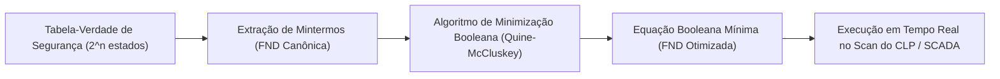

# Aula 05: Formas Normais (FND/FNC) e Otimização Booleana

## 1. Fundamentos Matemáticos: Formas Canônicas e Minimização

Na álgebra proposicional, qualquer função lógica $f(x_1, x_2, \dots, x_n)$ pode ser expressa em duas formas canônicas padrão:

1. **Forma Normal Disjuntiva (FND / Soma de Produtos - SOP):**
   - Disjunção ($\lor$) de mintermos (termos conjuntivos contendo todas as variáveis ou suas negações).
   - $f = \bigvee_{m \in Mintermos} m$.
   - Representa os estados onde a saída do processo é **Verdadeira ($1$)**.

2. **Forma Normal Conjuntiva (FNC / Produto de Somas - POS):**
   - Conjunção ($\land$) de maxtermos (termos disjuntivos).
   - $f = \bigwedge_{M \in Maxtermos} M$.
   - Representa o isolamento e bloqueio de todas as combinações de falha **Falsas ($0$)**.

3. **Teoremas de Minimização (Quine-McCluskey e Mapas de Karnaugh):**
   - Otimização do número de literais e portas lógicas utilizando a lei do consenso e adjacência lógica:
     $$(A \land B) \lor (A \land \neg B) \equiv A \land (B \lor \neg B) \equiv A$$

---

## 2. Aplicação em Engenharia: Otimização de Varredura no Scan do SCADA

Em plantas químicas com mais de $10.000$ *Tags*, o motor de intertravamento do SCADA executa loops de avaliação lógica a cada $10\text{ ms}$. Expressões booleanas não otimizadas aumentam o consumo de CPU e o tempo de resposta (*latency*).

---

## 3. Entregável da Aula 05

* **Otimizador Booleano em Python:** Algoritmo capaz de converter tabelas-verdade arbitrárias em FND e FNC canônicas e produzir a versão minimizada por eliminação de termos redundantes.
