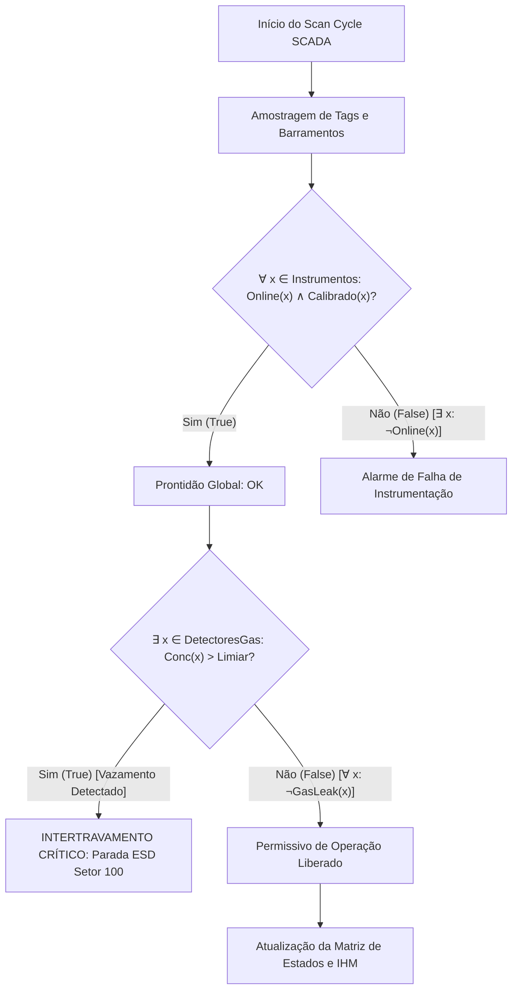

# Aula 06: Lógica de Predicados, Quantificadores e Varredura Global de Sensores

**Disciplina:** ECAA08 — Automática (2026.2)  
**Contexto:** Projeto SCADA-Core Automática / Planta de Fertilizantes Químicos  
**Perfil:** Engenharia de Controle e Automação (Matemática Discreta & Sistemas Críticos)  

---

## 1. Fundamentos Matemáticos: Lógica de Predicados e Quantificadores

Na lógica proposicional (estudada nas Aulas 02 a 05), cada proposição representa uma afirmação atômica com valor-verdade fixo ($0$ ou $1$). Contudo, em sistemas industriais com centenas de instrumentos e variáveis distribuídas, a lógica proposicional torna-se redundante e insuficiente para expressar propriedades coletivas, tais como: *"todos os sensores da área de síntese estão saudáveis"* ou *"existe ao menos uma válvula de alívio com sobrepressão"*.

Para superar essa limitação, empregamos a **Lógica de Primeira Ordem (LPO)** ou **Lógica de Predicados**.

### 1.1. Predicados e Variáveis

* **Universo de Discurso ($\mathcal{U}$):** Conjunto de todos os objetos sob análise. Na automação da fábrica, $\mathcal{U}$ pode ser o conjunto de todos os instrumentos ($\mathcal{I}$), setores ($\mathcal{S}$), atuadores ($\mathcal{A}$) ou malhas de controle ($\mathcal{M}$).
* **Predicado $P(x)$:** Função proposicional que mapeia um elemento $x \in \mathcal{U}$ em um valor-verdade $\{\text{Verdadeiro}, \text{Falso}\}$.
  - Exemplo: $\text{Online}(x) \in \{0, 1\}$ denota se o instrumento $x$ está respondendo na rede industrial (Profinet/Modbus).
  - Exemplo: $\text{Critico}(x, v) \in \{0, 1\}$ denota se o sensor $x$ registrou valor acima do limiar seguro $v$.

---

### 1.2. Quantificador Universal ($\forall$)

O quantificador universal expressa que uma propriedade é satisfeita por **todos** os elementos do universo de discurso:

$$\forall x \in \mathcal{U}, P(x)$$

Em um universo finito de instrumentos $\mathcal{U} = \{i_1, i_2, \dots, i_n\}$, a quantificação universal equivale à **conjunção generalizada**:

$$\forall x \in \mathcal{U}, P(x) \iff P(i_1) \land P(i_2) \land \dots \land P(i_n)$$

* **Critério de Falsidade:** Basta existir **um único contraexemplo** $k \in \mathcal{U}$ tal que $P(k) = \text{Falso}$ para que toda a sentença $\forall x P(x)$ seja falsa (*curto-circuito lógico*).

---

### 1.3. Quantificador Existencial ($\exists$)

O quantificador existencial expressa que uma propriedade é satisfeita por **pelo menos um** elemento do domínio:

$$\exists x \in \mathcal{U}, Q(x)$$

Para um universo finito $\mathcal{U} = \{i_1, i_2, \dots, i_n\}$, a quantificação existencial equivale à **disjunção generalizada**:

$$\exists x \in \mathcal{U}, Q(x) \iff Q(i_1) \lor Q(i_2) \lor \dots \lor Q(i_n)$$

* **Critério de Veracidade:** Basta encontrar uma **testemunha** (*witness*) $k \in \mathcal{U}$ tal que $Q(k) = \text{Verdadeiro}$ para validar a sentença $\exists x Q(x)$.

---

### 1.4. Quantificação sobre Subconjuntos Restritos (Predicado Guardião)

Na engenharia de automação, frequentemente quantificamos sobre subconjuntos específicos de instrumentos (ex: apenas detectores de gás $\text{AT}$ ou apenas válvulas $\text{XV}$):

1. **Universal Restrito:**
   $$\forall x \in \mathcal{S}, P(x) \iff \forall x (\text{PertenceAoSetor}(x, \mathcal{S}) \rightarrow P(x))$$
2. **Existencial Restrito:**
   $$\exists x \in \mathcal{S}, Q(x) \iff \exists x (\text{PertenceAoSetor}(x, \mathcal{S}) \land Q(x))$$

> [!IMPORTANT]
> Observe o conectivo lógico associado a cada quantificador com domínio restrito: o quantificador universal exige a **implicação** ($\rightarrow$), enquanto o quantificador existencial exige a **conjunção** ($\land$).

---

### 1.5. Leis de De Morgan para Quantificadores (Dualidade Lógica)

A negação de quantificadores é o pilar formal para a síntese de alarmes e intertravamentos *fail-safe*:

$$\neg (\forall x P(x)) \equiv \exists x (\neg P(x))$$
$$\neg (\exists x Q(x)) \equiv \forall x (\neg Q(x))$$

**Interpretação Prática em Engenharia:**
- *"Não é verdade que todos os sensores estão saudáveis"* $\iff$ *"Existe pelo menos um sensor com falha"*.
- *"Não existe vazamento detectado na planta"* $\iff$ *"Todos os detectores de gás registram nível seguro"*.

---

## 2. Aplicação em Engenharia: Motor de Varredura Global de Sensores (SCADA-Core)

No ciclo de varredura (*scan cycle*) de um CLP ou sistema SCADA industrial, o subsistema de diagnóstico deve verificar em tempo real o estado de dezenas a milhares de instrumentos distribuídos.

---

## 3. Modelagem de Predicados da Planta de Fertilizantes

Considerando a planta química de fertilizantes (Setor 100: Reação/Neutralização $\text{NH}_3 + \text{H}_3\text{PO}_4$; Setor 200: Granulação e Secagem NPK):

### Tabela de Predicados do Processo

| Predicado | Notação | Descrição |
| :--- | :--- | :--- |
| $\text{IsOnline}(x)$ | $O(x)$ | O instrumento $x$ está comunicando via rede sem timeout |
| $\text{IsCalibrated}(x)$ | $C(x)$ | O instrumento $x$ está dentro do período válido de calibração |
| $\text{GasAlarm}(x)$ | $G(x)$ | O detector $x \in \mathcal{D}_{\text{gás}}$ acusa concentração $> 25\text{ ppm}$ |
| $\text{OverPress}(x)$ | $P_{\text{hi}}(x)$ | O transmissor de pressão $x \in \mathcal{P}$ mede $P > P_{\text{max}}$ |
| $\text{OverTemp}(x)$ | $T_{\text{hi}}(x)$ | O transmissor de temperatura $x \in \mathcal{T}$ mede $T > T_{\text{max}}$ |
| $\text{ValveOpen}(x)$ | $V_{\text{op}}(x)$ | A válvula de controle/bloqueio $x \in \mathcal{V}$ confirma fim-de-curso aberta |
| $\text{PumpRunning}(x)$ | $M_{\text{on}}(x)$ | A bomba/motor $x \in \mathcal{M}$ reporta contator e corrente nominais |

### Equações Lógicas Globais de Segurança

1. **Prontidão Geral da Planta para Partida ($\text{PlantReadiness}$):**
   $$\text{PlantReadiness} \iff (\forall x \in \mathcal{I}, O(x) \land C(x)) \land (\forall y \in \mathcal{D}_{\text{gás}}, \neg G(y))$$

2. **Intertrava de Alívio Térmico do Reator ($\text{ThermalTrip}$):**
   $$\text{ThermalTrip} \iff \exists t \in \mathcal{T}_{\text{Reator}}, T_{\text{hi}}(t)$$

3. **Permissivo de Roteamento de Slurry para Granulador ($\text{Perm}_{\text{Slurry}}$):**
   $$\text{Perm}_{\text{Slurry}} \iff (\forall v \in \mathcal{V}_{\text{Linha}}, V_{\text{op}}(v)) \land (\exists p \in \mathcal{M}_{\text{Bombas}}, M_{\text{on}}(p)) \land (\neg \exists s \in \mathcal{P}_{\text{Linha}}, P_{\text{hi}}(s))$$

---

## 4. Entregável da Aula 06

* **Módulo de Varredura de Estado (*State Scanning Engine*):** Código Python em Jupyter Notebook contendo:
  1. Estrutura de dados para sensores e atuadores da planta de fertilizantes.
  2. Implementação dos operadores de quantificação $\forall$ (`forall`) e $\exists$ (`exists`) com identificação automática de falhas e testemunhas.
  3. Verificação de integridade global, monitoramento de gases tóxicos e alinhamento de rotas de reagentes.
  4. Validação formal das Leis de De Morgan para quantificadores.
  5. Benchmark de tempo de execução e avaliação em tempo real sob injeção de falhas.
