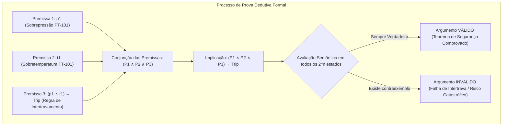

# Aula 07: Validade de Argumentos e Inferência Lógica na Segurança de Processos

## 1. Fundamentos Matemáticos: Argumentos Dedutivos, Validade e Tautologias

Na engenharia de controle e segurança de processos industriais (*Safety Instrumented Systems - SIS* / IEC 61511 e IEC 61508), a tomada de decisão crítica de parada de emergência (*Emergency Shutdown - ESD*) deve ser fundamentada na **Validade Lógica Dedutiva**.

### 1.1. Definição Formal de Argumento e Validade

Um **argumento dedutivo** é uma estrutura formal composta por um conjunto finito de premissas $\{P_1, P_2, \dots, P_k\}$ e uma conclusão $C$, denotado formalmente por:

$$P_1, P_2, \dots, P_k \vdash C$$

Diz-se que o argumento é **semanticamente válido** (denotado por $P_1, P_2, \dots, P_k \models C$) se e somente se for **impossível** que todas as premissas sejam verdadeiras e a conclusão seja simultaneamente falsa.

Pela equivalência fundamental do Teorema da Dedução:

$$\{P_1, P_2, \dots, P_k\} \models C \quad \iff \quad (P_1 \land P_2 \land \dots \land P_k) \rightarrow C \equiv \mathbf{T} \quad (\text{Tautologia})$$

---

## 2. Tabela de Regras Canônicas de Inferência Lógica Aplicadas à Automação

As regras de inferência são esquemas sintáticos de transformação válidos que garantem que, a partir de premissas verdadeiras, a conclusão inferida seja infalivelmente verdadeira.

| Regra de Inferência | Esquema Formal | Aplicação no SCADA / Indústria Química |
| :--- | :---: | :--- |
| **Modus Ponens (MP)** | $\begin{aligned} & P \rightarrow Q \\ & P \\ \hline \therefore & Q \end{aligned}$ | Se a temperatura ultrapassar $200^\circ\text{C}$, corte o vapor ($T > 200 \rightarrow \text{Corte}$). O sensor mediu $215^\circ\text{C}$ ($T > 200$). **Conclusão:** Cortar vapor imediatamente. |
| **Modus Tollens (MT)** | $\begin{aligned} & P \rightarrow Q \\ & \neg Q \\ \hline \therefore & \neg P \end{aligned}$ | Se a bomba $\text{P-101}$ estivesse ligada ($P$), haveria fluxo no sensor $\text{FS-101}$ ($Q$). Não há fluxo ($\neg Q$). **Conclusão:** A bomba não está ligada (diagnóstico de trip mecânico). |
| **Silogismo Hipotético (SH)** | $\begin{aligned} & P \rightarrow Q \\ & Q \rightarrow R \\ \hline \therefore & P \rightarrow R \end{aligned}$ | Fuga de $\text{NH}_3$ ($P$) implica fechamento de $\text{XV-101}$ ($Q$). Fechar $\text{XV-101}$ ($Q$) implica isolar o tanque de amônia ($R$). **Conclusão:** Fuga de $\text{NH}_3$ implica isolar o tanque. |
| **Silogismo Disjuntivo (SD)** | $\begin{aligned} & P \lor Q \\ & \neg P \\ \hline \therefore & Q \end{aligned}$ | A alimentação deve ser provida pela Bomba $\text{A}$ ou Bomba $\text{B}$ ($P \lor Q$). A Bomba $\text{A}$ desarmou por sobrecarga ($\neg P$). **Conclusão:** Acionar a Bomba $\text{B}$. |
| **Resolução Proposicional** | $\begin{aligned} & P \lor Q \\ & \neg P \lor R \\ \hline \therefore & Q \lor R \end{aligned}$ | Fusão de cláusulas de segurança para eliminação de variáveis intermediárias e simplificação de rotas de alarme. |
| **Dilema Construtivo (DC)** | $\begin{aligned} & (P \rightarrow Q) \land (R \rightarrow S) \\ & P \lor R \\ \hline \therefore & Q \lor S \end{aligned}$ | Se alta pressão, abrir $\text{PSV-101}$; se alto nível, abrir descarte $\text{XV-103}$. Ocorreu alta pressão ou alto nível. **Conclusão:** Abrir $\text{PSV-101}$ ou $\text{XV-103}$. |

---

## 3. Teorema da Refutação e Prova por Contradição (*Reductio ad Absurdum*)

Na validação automatizada de sistemas críticos por solucionadores SAT (*SAT Solvers*), a validade do argumento $P_1, P_2, \dots, P_k \vdash C$ é provada por **refutação**:

$$\{P_1, P_2, \dots, P_k, \neg C\} \models \mathbf{F} \quad (\text{Insatisfatível})$$

Se for impossível encontrar uma valoração de variáveis que torne todas as premissas verdadeiras e a conclusão falsa simultaneamente, então a negação da conclusão gera uma **contradição**, provando a validade incondicional do protocolo de segurança.

---

## 4. Falácias Formais Comuns em Projetos de Automação

É fundamental distinguir argumentos dedutivos válidos de **falácias lógicas**, que frequentemente causam acidentes industriais graves quando incorporadas em lógicas de CLP:

1. **Afirmação do Consequente (Falácia):**
   $$P \rightarrow Q, \; Q \not\vdash P$$
   *Exemplo errôneo:* "Se houver sobrepressão ($P$), a válvula de alívio $\text{PSV-101}$ abre ($Q$). A válvula abriu ($Q$). Logo, há sobrepressão ($P$)." $\rightarrow$ **Inválido**, pois a válvula pode ter sido aberta manualmente por teste ou falha mecânica da mola.

2. **Negação do Antecedente (Falácia):**
   $$P \rightarrow Q, \; \neg P \not\vdash \neg Q$$
   *Exemplo errôneo:* "Se houver vazamento de gás ($P$), evacue a área ($Q$). Não há vazamento de gás ($\neg P$). Logo, não evacue a área ($\neg Q$)." $\rightarrow$ **Inválido**, pois a evacuação pode ser exigida por incêndio ou sobreaquecimento.

---

## 5. Entregável da Aula 07

* **Módulo `ProvadorDedutivoFormal` em Python:**
  1. Motor de verificação de argumentos por **Tabela-Verdade Exaustiva** ($2^n$ estados).
  2. Motor de verificação por **Refutação e Contradição** ($\{P_1, \dots, P_k, \neg C\} \equiv \mathbf{F}$).
  3. Verificador de esquemas canônicos nomeados (Modus Ponens, Modus Tollens, Silogismo Hipotético, Silogismo Disjuntivo e Resolução).
  4. Testes formais automatizados cobrindo intertravamentos de segurança e detecção de falácias industriais.
