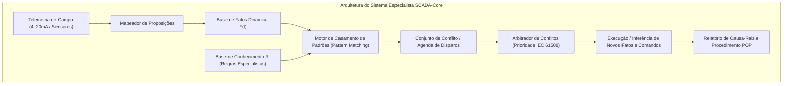

# Aula 08: Sistemas Especialistas — Base de Conhecimento e Regras de Diagnóstico

## 1. Fundamentos Matemáticos: Arquitetura de Sistemas Baseados em Regras (RBS)

Em plantas químicas de fertilizantes, a ocorrência de distúrbios operacionais simultâneos exige diagnósticos automáticos rápidos baseados em **Sistemas Especialistas Baseados em Regras** (*Rule-Based Expert Systems*).

Formalmente, um Sistema Baseado em Regras é modelado pela tripla:

$$\langle \mathcal{F}, \mathcal{R}, \mathcal{E} \rangle$$

Onde:
1. **$\mathcal{F}$ (Base de Fatos):** Conjunto finito de proposições que representam o estado instantâneo da planta industrial:
   $$\mathcal{F}(t) = \{f_1, f_2, \dots, f_m\} \subseteq \mathcal{U}_{\text{fatos}}$$
2. **$\mathcal{R}$ (Base de Conhecimento / Regras de Produção):** Conjunto de sentenças em **Cláusulas de Horn Definidas** da forma:
   $$R_i: \quad \text{SE } (A_{i,1} \land A_{i,2} \land \dots \land A_{i,k}) \quad \text{ENTÃO } \quad C_i$$
   Equivalentemente em lógica formal:
   $$\neg A_{i,1} \lor \neg A_{i,2} \lor \dots \lor \neg A_{i,k} \lor C_i$$
3. **$\mathcal{E}$ (Estratégia de Resolução e Conflito):** Critérios de arbitragem para seleção de regras ativadas simultaneamente (Prioridade de Segurança SIL, Especificidade e Recência).

---

## 2. Catálogo Especialista de Falhas da Planta de Fertilizantes

A base de conhecimento cobre os 6 cenários industriais mais críticos do complexo de fertilizantes:

| ID Regra | Antecedentes ($\bigwedge A_i$) | Consequente ($C_i$) | Diagnóstico de Causa-Raiz | Severidade / Ação |
| :--- | :--- | :--- | :--- | :--- |
| **R-01** | `PT-101_HIGH` $\land$ `TT-101_HIGH` | `REACAO_RUNAWAY` | **Exotermia Descontrolada no Reator R-101** | **CRÍTICA (SIL 3):** Desarme total de alimentação |
| **R-02** | `REACAO_RUNAWAY` $\land$ `XV-101_ABERTA` | `TRIP_ALIMENTACAO_NH3` | **Corte Imediato de Amônia Anidra** | **EMERGÊNCIA:** Fechar válvula $\text{XV-101}$ em $< 1\text{ s}$ |
| **R-03** | `LT-101_LOW` $\land$ `P-101_LIGADA` | `CAVITACAO_BOMBA_P101` | **Risco Iminente de Cavitação e Destruição Mecânica** | **ALTA:** Desligar bomba $\text{P-101}$ |
| **R-04** | `AT-101_HIGH` | `FUGA_TOXICA_NH3` | **Vazamento Atmosférico de Amônia no Setor 100** | **CRÍTICA:** Evacuação e acionamento de cortina d'água |
| **R-05** | `FS-201_LOW` $\land$ `TS-201_OFF` | `FALHA_COMBUSTAO_SECADOR` | **Extinção de Chama no Queimador do Secador 201** | **ALTA:** Cortar gás natural e purgar câmara |
| **R-06** | `PT-301_HIGH` $\land$ `TT-301_HIGH` | `SOBREPRESSAO_TANQUE_CRIO` | **Fervura Excessiva (*Boil-Off*) no Tanque de $\text{NH}_3$** | **CRÍTICA:** Despressurizar para o Flare |

---

## 3. Resolução de Conflitos e Inconsistências na Base

Uma Base de Conhecimento industrial deve ser livre de **contradições** e **redundâncias**:
1. **Consistência:** Não podem existir regras tais que $A \rightarrow C$ e $A \rightarrow \neg C$ coexistam com mesmo peso.
2. **Priorização por Severidade:** Regras de segurança de vida humana e integridade física de vasos de pressão têm prioridade estrita ($\text{Prio} = 10$) sobre regras de eficiência econômica ($\text{Prio} = 1$).

---

## 4. Entregável da Aula 08

* **Estrutura Orientada a Objetos em Python:**
  1. Classe `Fato`: Modelagem de proposições com timestamp, fonte e valor.
  2. Classe `RegraDiagnostico`: Representação de Cláusulas de Horn com antecedentes, consequente, prioridade, tempo de resposta e Procedimento Operacional Padrão (POP).
  3. Classe `BaseConhecimentoSCADA`: Gerenciador com indexação de antecedentes, validação de integridade e exportação tabular completa.
