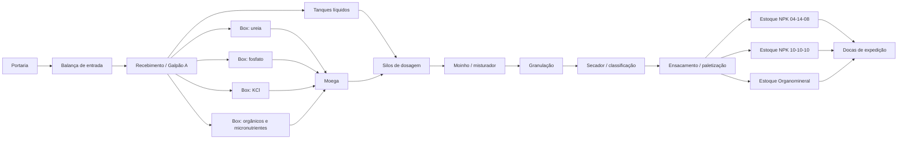
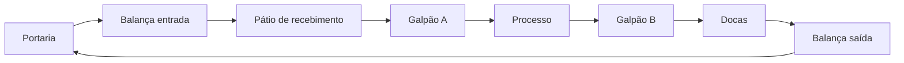

# Aula 18: Grafos de Logística de Insumos, Processo e Produtos Acabados

## 1. Situação-problema

Nas aulas anteriores, a planta foi representada principalmente pela malha de processo: tanques, tubulações, bombas, reator e granulador. A operação industrial completa também exige decidir **como os insumos chegam ao processo** e **como o produto acabado alcança a expedição**.

A imagem [Grafo_Logitica.jpeg](./Grafo_Logitica.jpeg) apresenta o layout didático da fábrica. Ela identifica, entre outros elementos:

* portaria e balança de entrada;
* Galpão A, com boxes de ureia, fosfato, cloreto de potássio, matéria orgânica/micronutrientes e tanques de líquidos;
* moega, silos de dosagem, moinho/misturador, granulação e secador;
* ensacamento/paletização e os estoques NPK 04-14-08, NPK 10-10-10 e Organomineral Premium no Galpão B;
* docas de carregamento e saída.

O objetivo desta aula é construir grafos que conectem esses setores ao processo de fertilizantes descrito na [Etapa 01](../etapa-01-logica/00%20-%20Insumos.md), sem confundir fluxos fisicamente diferentes.

> **Nota metodológica:** os comprimentos empregados nesta aula são estimativas didáticas para comparação de rotas. A imagem é uma planta esquemática; portanto, ela não deve ser usada para medir distâncias operacionais reais.

---

## 2. Fundamentos Teóricos: Redes Multicamada e Grafos Acíclicos Dirigidos

### 2.1. Por que a Cadeia Logística é um DAG

Diferente da malha de tubulação das Aulas 11-15 (que contém ciclos de contingência, como as rotas paralelas via P-101/P-102), o fluxo de materiais $G_M$ desta aula — do recebimento até a expedição — é, por definição de processo, um **Grafo Acíclico Dirigido (DAG — *Directed Acyclic Graph*)**: não existe caminho que retorne a um vértice já visitado, pois cada etapa de transformação (dosagem, moagem, granulação, secagem, ensaque) é irreversível dentro do fluxo normal de produção.

**Definição formal:** um dígrafo $G=(V,E)$ é um DAG se não existe nenhum ciclo dirigido, ou seja, não existe sequência $v_0, v_1, \dots, v_k = v_0$ com $(v_{i-1}, v_i) \in E$ para todo $i$.

**Propriedade fundamental (ordenação topológica):** todo DAG admite pelo menos uma **ordenação topológica**, isto é, uma numeração dos vértices $\text{ord}: V \rightarrow \{1, \dots, n\}$ tal que, para toda aresta $(u,v) \in E$, $\text{ord}(u) < \text{ord}(v)$. Essa propriedade é o que torna o grafo de processo auditável: qualquer sequência de produção pode ser verificada como fisicamente possível apenas checando se ela respeita a ordenação topológica do DAG — por exemplo, o modelo não permite que `Ensacamento / paletização` ocorra antes de `Granulação`, porque não existe nenhuma ordenação topológica compatível com essa inversão.

**Algoritmo de Kahn (1962):** calcula uma ordenação topológica em $O(|V|+|E|)$ processando repetidamente vértices de grau de entrada zero, removendo-os do grafo (e decrementando o grau de entrada de seus sucessores) até que todos os vértices tenham sido processados. Se, ao final, restarem vértices com grau de entrada positivo, o grafo **não** é um DAG — um teste direto e eficiente de aciclicidade, complementar à análise de arestas de retorno via DFS vista na Aula 13.

### 2.2. Redes Multicamada (*Multilayer Networks*)

A estratégia adotada de modelar **três grafos distintos** ($G_M$, $G_V$, $G_E$) sobre a mesma planta física é um caso particular do que a literatura de ciência de redes chama de **rede multicamada**: um mesmo conjunto (ou conjuntos sobrepostos) de entidades físicas é representado por múltiplas camadas de conexão, cada uma correspondendo a um tipo diferente de relação. Formalmente, uma rede multicamada é uma tupla $\mathcal{M} = (\{G_\alpha\}_{\alpha \in L}, \{V_\alpha\}, \{E_{\alpha\beta}\})$, onde $L$ é o conjunto de camadas (aqui, `materiais`, `veículos`, `estoque`) e $E_{\alpha\beta}$ pode incluir arestas de acoplamento entre camadas (por exemplo, ligando o vértice `Galpão A` de $G_V$ ao vértice `Recebimento / Galpão A` de $G_M$, pois fisicamente é o mesmo espaço).

O motivo de **não colapsar tudo em um único grafo** é evitar um erro clássico de modelagem: aplicar um algoritmo de uma camada (como Dijkstra sobre $G_M$) para responder uma pergunta que pertence a outra camada (como a rota de circulação de uma empilhadeira em $G_V$). Vértices com o mesmo nome textual em camadas diferentes (`Galpão A`, por exemplo) **não são o mesmo vértice do grafo** — são representações de um mesmo espaço físico sob óticas distintas (fluxo de material vs. circulação de veículo), e misturar as arestas das duas camadas produziria rotas fisicamente inválidas.

### 2.3. Cadeia de Suprimentos como Composição de Grafos

Uma cadeia de suprimentos completa (*supply chain*) pode ser vista como a composição de subgrafos menores, cada um estudável com as ferramentas já vistas nesta etapa:

| Subproblema da cadeia | Ferramenta da Etapa 02 aplicável |
| --- | --- |
| Menor rota entre fornecedor e fábrica | Dijkstra (Aula 14) |
| Verificar se existe rota alternativa em caso de bloqueio de uma via | Reponderação dinâmica (Aula 15) |
| Planejar a rota de um veículo que visita múltiplos clientes e retorna à base | TSP com heurística NN + 2-Opt (Aula 17) |
| Auditar se a sequência de produção respeita a ordem física do processo | Ordenação topológica de DAG (Seção 2.1 desta aula) |
| Verificar a robustez da cadeia a uma única falha de trecho | Detecção de pontes (Aula 15, Seção 2.4) |

Essa tabela evidencia o objetivo pedagógico da Etapa 02 como um todo: os mesmos poucos algoritmos fundamentais (BFS, DFS, Dijkstra, Hierholzer, heurísticas de TSP) se recombinam para responder a praticamente todas as perguntas operacionais de uma planta industrial — da tubulação interna à logística externa.

### 2.4. Limitações do Modelo com Peso Único

Os grafos $G_M$ e $G_V$ implementados nesta aula usam um único escalar de peso (distância estimada). Em uma modelagem mais completa, cada aresta poderia carregar um **vetor de custos** $\vec{w}(u,v) = (\text{distância}, \text{tempo}, \text{custo monetário}, \text{risco})$, transformando o problema de menor caminho em um **problema de otimização multiobjetivo**, que não possui, em geral, uma única "melhor" rota, mas sim uma **fronteira de Pareto** de soluções não-dominadas. Esse tópico avançado é mencionado aqui como direção de aprofundamento, mas foge do escopo desta etapa introdutória.

---

## 3. Três grafos para o mesmo layout

Um único grafo não expressa adequadamente todas as regras da fábrica. Modelaremos três redes.

| Grafo | Vértices | Arestas dirigidas | Peso | Pergunta respondida |
| --- | --- | --- | --- | --- |
| $G_M$ — fluxo de materiais | setores, equipamentos e estoques | transferência permitida de material | distância interna estimada (m) | Como um insumo chega à doca como produto acabado? |
| $G_V$ — circulação de veículos | portaria, balanças, pátios, galpões e docas | trechos autorizados para caminhão/empilhadeira | distância de circulação estimada (m) | Qual rota interna o veículo pode percorrer? |
| $G_E$ — alocação de estoque | paletização, posições de estoque e docas | endereçamento e retirada de produto | movimentações ou custo de manuseio | Onde armazenar e de onde retirar cada formulação? |

O notebook desta aula implementa $G_M$ e $G_V$. A mesma estrutura pode receber custos monetários, tempo, emissões ou risco, desde que todos os pesos de uma consulta representem a mesma grandeza.

---

## 4. Grafo dirigido do fluxo de materiais

Definimos:

$$G_M=(V_M,E_M,w_M), \qquad w_M:E_M\rightarrow\mathbb{R}_{\geq0}.$$

O conjunto de vértices inclui os pontos observados no layout:

As arestas de `Portaria` até `Recebimento / Galpão A` representam a liberação e a entrada física do caminhão. A partir do recebimento, as arestas representam a disponibilidade do insumo para a transferência interna. Assim, uma rota no grafo é uma **rota operacional de referência**, e não uma alegação de que o mesmo caminhão percorre todas as etapas de fabricação.

### 4.1. Correspondência com os insumos da Etapa 01

| Insumo da Etapa 01 | Vértice de recebimento | Uso no modelo |
| --- | --- | --- |
| Ureia / fonte nitrogenada | `Box: ureia` | alimentação sólida da moega |
| Fosfato / MAP / DAP | `Box: fosfato` | alimentação sólida da moega |
| Cloreto de potássio (KCl) | `Box: KCl` | alimentação sólida da moega |
| Matéria orgânica e micronutrientes | `Box: orgânicos e micronutrientes` | formulação organomineral |
| Aditivos e condicionadores líquidos | `Tanques líquidos` | alimentação direta dos silos de dosagem |

Os produtos NPK 04-14-08, NPK 10-10-10 e Organomineral Premium aparecem como vértices distintos para preservar a rastreabilidade da alocação após a paletização.

---

## 5. Grafo de circulação de veículos

O fluxo de materiais é dirigido: não se deve retornar produto acabado à moega sem uma regra específica de retrabalho. Já o anel viário do layout pode ter trechos bidirecionais ou de sentido único. Para cada sentido permitido, inclua uma aresta em $G_V$.

Essa separação impede um erro comum: aplicar Dijkstra sobre o fluxo de materiais para decidir por onde uma empilhadeira deve circular. Os vértices podem ter nomes semelhantes, mas o conjunto de arestas e as restrições são diferentes.

### 5.1. O Anel Viário como Ciclo Hamiltoniano Degenerado

Vale notar que $G_V$, ao contrário de $G_M$, **contém um ciclo dirigido** por construção: `Portaria -> ... -> Docas -> Balança de saída -> Portaria`. Esse ciclo não é uma falha de modelagem — reflete o fato de que o mesmo veículo entra e sai da planta pelo mesmo ponto de controle (a portaria), fechando o percurso. Trata-se de um caso particular (e simplificado) de Ciclo Hamiltoniano, no sentido da Aula 17: se a planta tivesse múltiplos pontos de coleta de material a serem visitados em uma única viagem, o problema de definir a melhor ordem de visita se reduziria exatamente ao TSP estudado naquela aula, com a heurística NN + 2-Opt aplicável diretamente.

---

## 6. Exemplo Resolvido

**Pergunta:** Por que a rota de menor custo de `Portaria` até `Docas de expedição` em $G_M$ passa por `Tanques líquidos` no lugar de qualquer um dos boxes sólidos (ureia, fosfato, KCl), como reportado pelo notebook?

**Resolução:** Isso decorre diretamente dos pesos atribuídos às arestas de recebimento: `Recebimento / Galpão A -> Tanques líquidos` tem peso $28$, enquanto os boxes sólidos têm pesos entre $18$ e $25$; entretanto, a etapa seguinte de `Tanques líquidos -> Silos de dosagem` (peso $45$) é mais curta que o caminho equivalente pelos boxes sólidos, que precisam primeiro passar pela `Moega de recepção` (peso adicional de $30$ a $38$) antes de alcançar os `Silos de dosagem` (mais $40$). Somando os dois trechos, a rota via tanques líquidos ($28+45=73$) é mais curta que qualquer rota via um box sólido (por exemplo, via KCl: $22+30+40=92$). Esse resultado ilustra por que o algoritmo de Dijkstra deve sempre considerar a **soma acumulada** do caminho, e não apenas o peso do primeiro trecho — um erro comum de interpretação para quem está aprendendo o algoritmo.

---

## 7. Atividades de investigação

1. Execute o notebook e identifique o caminho mínimo de `Portaria` até cada um dos três estoques de produto acabado em $G_M$.
2. Remova temporariamente a aresta `Ensacamento / paletização -> Estoque NPK 10-10-10`. O que o algoritmo informa? Relacione o resultado a uma indisponibilidade de área de armazenagem.
3. No $G_V$, altere uma via de mão dupla para mão única e verifique se ainda existe ciclo `Portaria -> ... -> Portaria`.
4. Substitua os pesos em metros por tempo médio (minutos). Explique por que uma rota mais curta em metros pode deixar de ser a melhor rota logística.
5. Inclua um vértice `Área de quarentena` entre o recebimento e a moega. Que regra de qualidade deve liberar a nova aresta?

---

## 8. Entregável da Aula 18

* **Modelo `GrafoLogistico` em Python:** criação de rotas dirigidas e ponderadas, cálculo do menor caminho por Dijkstra e validação de uma rota de recebimento até a expedição.
* **Dois modelos coerentes:** uma rede para fluxo de materiais e outra para circulação interna, ambas baseadas nos setores mostrados em [Grafo_Logitica.jpeg](./Grafo_Logitica.jpeg).
