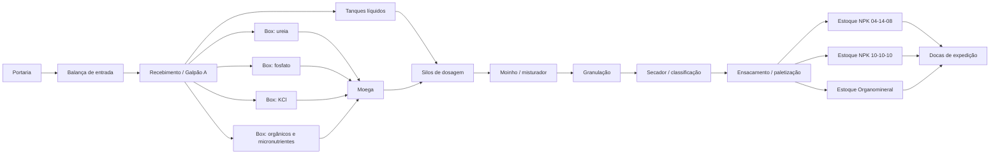

# Aula 18: Grafos de Logística de Insumos, Processo e Produtos Acabados

## 1. Situação-problema

Nas aulas anteriores, a planta foi representada principalmente pela malha de processo: tanques, tubulações, bombas, reator e granulador. A operação industrial completa também exige decidir **como os insumos chegam ao processo** e **como o produto acabado alcança a expedição**.

A imagem [Grafo_Logitica.jpeg](./Grafo_Logitica.jpeg) apresenta o layout didático da fábrica. Ela identifica, entre outros elementos:

* portaria e balança de entrada;
* Galpão A, com boxes de ureia, fosfato, cloreto de potássio, matéria orgânica/micronutrientes e tanques de líquidos;
* moega, silos de dosagem, moinho/misturador, granulação e secador;
* ensacamento/paletização e os estoques NPK 04-14-08, NPK 10-10-10 e Organomineral Premium no Galpão B;
* docas de carregamento e saída.

O objetivo desta aula é construir grafos que conectem esses setores ao processo de fertilizantes descrito na [Etapa 01](../etapa-01-logica/00%20-%20Insumos.md), sem confundir fluxos fisicamente diferentes.

> **Nota metodológica:** os comprimentos empregados nesta aula são estimativas didáticas para comparação de rotas. A imagem é uma planta esquemática; portanto, ela não deve ser usada para medir distâncias operacionais reais.

---

## 2. Três grafos para o mesmo layout

Um único grafo não expressa adequadamente todas as regras da fábrica. Modelaremos três redes.

| Grafo | Vértices | Arestas dirigidas | Peso | Pergunta respondida |
| --- | --- | --- | --- | --- |
| $G_M$ — fluxo de materiais | setores, equipamentos e estoques | transferência permitida de material | distância interna estimada (m) | Como um insumo chega à doca como produto acabado? |
| $G_V$ — circulação de veículos | portaria, balanças, pátios, galpões e docas | trechos autorizados para caminhão/empilhadeira | distância de circulação estimada (m) | Qual rota interna o veículo pode percorrer? |
| $G_E$ — alocação de estoque | paletização, posições de estoque e docas | endereçamento e retirada de produto | movimentações ou custo de manuseio | Onde armazenar e de onde retirar cada formulação? |

O notebook desta aula implementa $G_M$ e $G_V$. A mesma estrutura pode receber custos monetários, tempo, emissões ou risco, desde que todos os pesos de uma consulta representem a mesma grandeza.

---

## 3. Grafo dirigido do fluxo de materiais

Definimos:

$$G_M=(V_M,E_M,w_M), \qquad w_M:E_M\rightarrow\mathbb{R}_{\geq0}.$$

O conjunto de vértices inclui os pontos observados no layout:

As arestas de `Portaria` até `Recebimento / Galpão A` representam a liberação e a entrada física do caminhão. A partir do recebimento, as arestas representam a disponibilidade do insumo para a transferência interna. Assim, uma rota no grafo é uma **rota operacional de referência**, e não uma alegação de que o mesmo caminhão percorre todas as etapas de fabricação.

### 3.1. Correspondência com os insumos da Etapa 01

| Insumo da Etapa 01 | Vértice de recebimento | Uso no modelo |
| --- | --- | --- |
| Ureia / fonte nitrogenada | `Box: ureia` | alimentação sólida da moega |
| Fosfato / MAP / DAP | `Box: fosfato` | alimentação sólida da moega |
| Cloreto de potássio (KCl) | `Box: KCl` | alimentação sólida da moega |
| Matéria orgânica e micronutrientes | `Box: orgânicos e micronutrientes` | formulação organomineral |
| Aditivos e condicionadores líquidos | `Tanques líquidos` | alimentação direta dos silos de dosagem |

Os produtos NPK 04-14-08, NPK 10-10-10 e Organomineral Premium aparecem como vértices distintos para preservar a rastreabilidade da alocação após a paletização.

---

## 4. Grafo de circulação de veículos

O fluxo de materiais é dirigido: não se deve retornar produto acabado à moega sem uma regra específica de retrabalho. Já o anel viário do layout pode ter trechos bidirecionais ou de sentido único. Para cada sentido permitido, inclua uma aresta em $G_V$.

Essa separação impede um erro comum: aplicar Dijkstra sobre o fluxo de materiais para decidir por onde uma empilhadeira deve circular. Os vértices podem ter nomes semelhantes, mas o conjunto de arestas e as restrições são diferentes.

---

## 5. Atividades de investigação

1. Execute o notebook e identifique o caminho mínimo de `Portaria` até cada um dos três estoques de produto acabado em $G_M$.
2. Remova temporariamente a aresta `Ensacamento / paletização -> Estoque NPK 10-10-10`. O que o algoritmo informa? Relacione o resultado a uma indisponibilidade de área de armazenagem.
3. No $G_V$, altere uma via de mão dupla para mão única e verifique se ainda existe ciclo `Portaria -> ... -> Portaria`.
4. Substitua os pesos em metros por tempo médio (minutos). Explique por que uma rota mais curta em metros pode deixar de ser a melhor rota logística.
5. Inclua um vértice `Área de quarentena` entre o recebimento e a moega. Que regra de qualidade deve liberar a nova aresta?

---

## 6. Entregável da Aula 18

* **Modelo `GrafoLogistico` em Python:** criação de rotas dirigidas e ponderadas, cálculo do menor caminho por Dijkstra e validação de uma rota de recebimento até a expedição.
* **Dois modelos coerentes:** uma rede para fluxo de materiais e outra para circulação interna, ambas baseadas nos setores mostrados em [Grafo_Logitica.jpeg](./Grafo_Logitica.jpeg).
